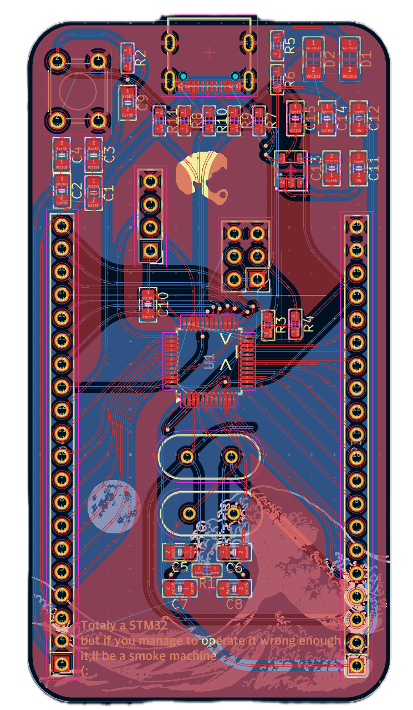
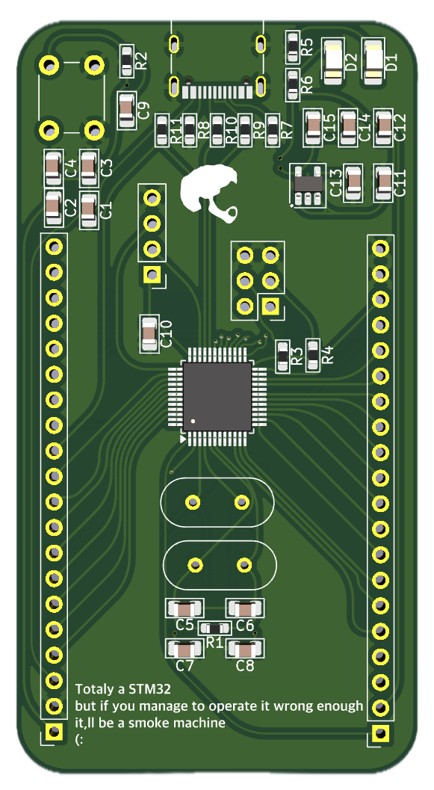
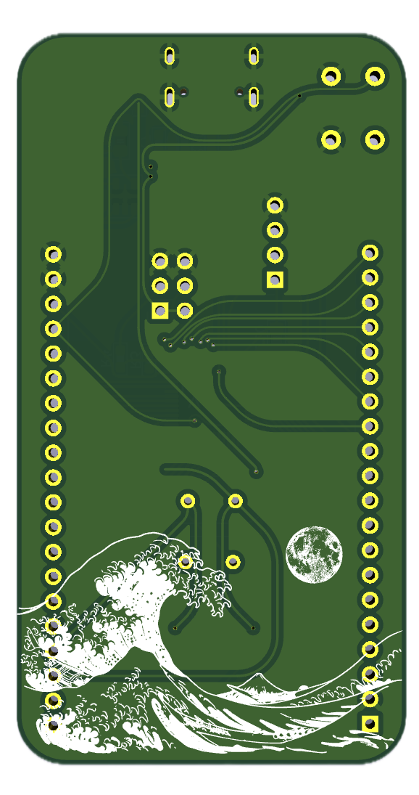

# BluePill
My custom STM32 Blue Pill redesign created in KiCad 9 (40×75 mm, 2-layer PCB) — personal hardware design showcase.

# STM32 Blue Pill Custom Board (KiCad 9)

This is a **custom PCB design** for the STM32F103C8T6 microcontroller (“Blue Pill”) created in **KiCad 9**.

```markdown





## 🧠 Overview
A modern redesign of the classic Blue Pill board, intended for easier prototyping and better reliability.

### ⚙️ Specifications
| Feature | Description |
|----------|--------------|
| **MCU** | STM32F103C8T6 (ARM Cortex-M3) |
| **Board Dimensions** | 40mm × 75mm |
| **USB** | Micro USB port for power and programming |
| **Clock** | 8 MHz main crystal + 32.768 kHz RTC crystal |
| **Programming Header** | SWD (4-pin) |
| **Voltage Regulator** | AMS1117-3.3 or compatible |
| **Power Input** | 5V via USB or pin header |
| **LEDs** | Power and user indicator LEDs |

## 🛠️ Tools Used
- **KiCad 9.0**
- **FreeCAD / Fusion 360** (optional, for 3D model editing)
- **ST-Link V2** for programming and debugging
